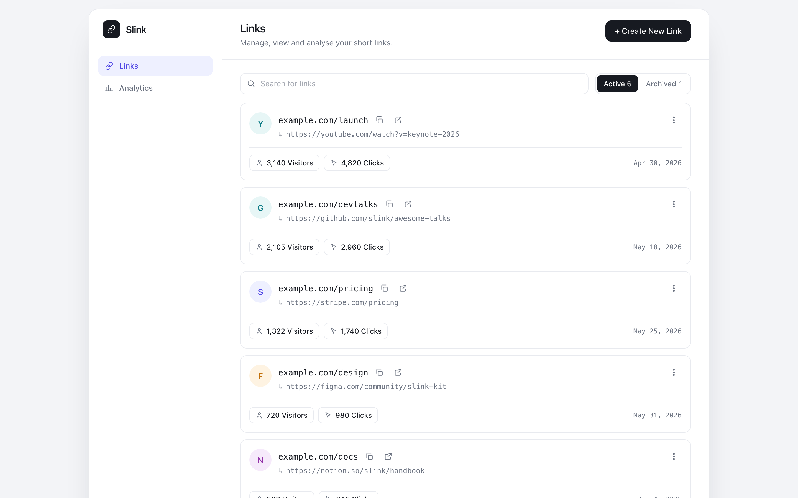
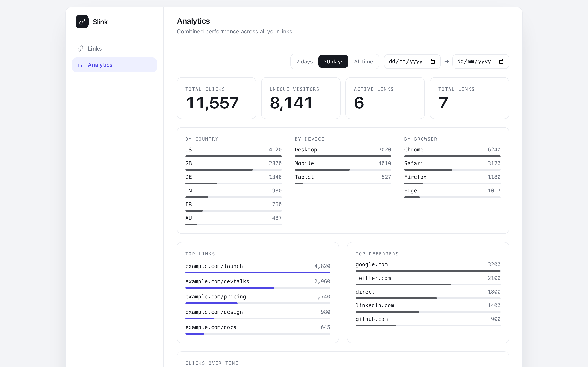
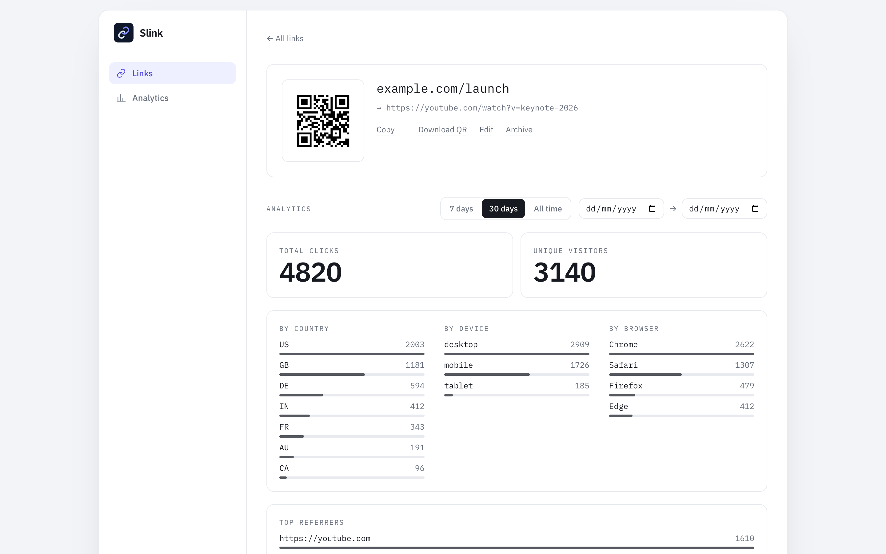

# Slink

A self-hosted link shortener with analytics, running on Cloudflare Workers + D1 at zero recurring cost.

Slink serves a React dashboard (link CRUD plus click analytics) under `/admin/`, exposes a JSON API under `/api/`, and resolves short links publicly at `/<slug>`. The dashboard and API are protected by Cloudflare Access; the short links stay public.

For the design rationale and trade-offs behind the implementation, see [DESIGN.md](./DESIGN.md).

## Screenshots

The admin dashboard (behind Cloudflare Access) for managing links and reading analytics. Create, search, archive, and copy short links, each with its own QR code:



| Account-wide analytics | Per-link detail |
| :---: | :---: |
|  |  |
| Clicks, unique visitors, and breakdowns by country, device, browser, and referrer across every link. | QR code, inline editing, and full time-series analytics for one link. |

<sub>Full-page captures: [links](assets/dashboard-links.png), [analytics](assets/dashboard-analytics.png), [link detail](assets/dashboard-detail.png). Screenshots use demo data.</sub>

## Architecture

- **One Worker, two hosts** (dispatched by hostname in `src/index.ts`):
  - `example.com` (`PUBLIC_HOST`) serves ONLY short-link redirects (`GET /:slug`).
  - `admin.example.com` serves the React dashboard (SPA from the `ASSETS` binding) and the
    `/api/*` JSON API.
- **Auth**: `admin.example.com` is behind a Cloudflare Access app; `/api/*` is re-verified
  in-Worker (`src/middleware/access.ts`) against `ACCESS_TEAM_DOMAIN` + `ACCESS_AUD`.
  `example.com` is intentionally public. See [Cloudflare Access](#cloudflare-access) below.
- **Data**: D1 (`DB` binding): `links` and `clicks` tables (`src/db/schema.ts`).
  Clicks are logged fire-and-forget on redirect; a daily cron prunes clicks older
  than `CLICKS_RETENTION_DAYS`.
- **Dashboard** (`dashboard/`): React + Vite + Tailwind, History-API router
  (`router.ts`, no router dep). Routes: `/` (list), `/analytics`, `/links/:slug`.
  Fonts self-hosted via `@fontsource` so the strict `'self'` CSP needs no exception.

## Prerequisites

To run or deploy Slink you need:

- **Node.js 20 or newer** (the version pinned in `.nvmrc`; with `nvm` installed, `nvm use` selects it). npm ships with Node.
- **Git**, to clone the repository.
- **A Cloudflare account** (the free tier covers Workers + D1, so there is no recurring cost).

Everything else is installed locally by `npm install`, so there are no global installs to manage. That includes the **[Wrangler](https://developers.cloudflare.com/workers/wrangler/install-and-update/)** CLI (Cloudflare's Workers tool), plus Vite, Drizzle Kit, and Vitest. Wrangler is always invoked through `npx wrangler`.

Before deploying, authenticate Wrangler against your Cloudflare account once (this opens a browser):

```bash
npx wrangler login
```

For CI or headless environments, set a `CLOUDFLARE_API_TOKEN` environment variable instead of running `wrangler login`.

## IMPORTANT: clone to a path with no spaces

The Workers test runtime (`workerd`, used by `wrangler dev` and the vitest pool) cannot resolve modules under a filesystem path that contains spaces. Keep the repo on a space-free path, for example:

```bash
~/projects/slink
```

A path that contains spaces, for example `~/My Projects/slink`, will break the local dev server and the test suite. Clone to a space-free path.

## Develop

All commands run from the repo root.

```bash
npm install
npm run db:migrate:local     # apply the committed migrations to the local D1 database
npm run build:dashboard      # build the React dashboard into dashboard/dist
npx wrangler dev                 # local dev: Worker + dashboard at http://localhost:8787/
npm test                     # run the vitest suite (Workers pool)
```

Other useful commands:

```bash
npm run typecheck                              # tsc --noEmit (worker)
npx tsc --noEmit -p dashboard/tsconfig.json    # typecheck the React dashboard
npm run deploy                                 # build dashboard + wrangler deploy
```

Migrations are committed under `migrations/`, so a fresh clone applies them
directly, with no generate step needed. Run `npm run db:generate` only after you
change `src/db/schema.ts`, to produce a new migration.

With `wrangler dev` running, the Worker treats `localhost` as the admin host and serves the dashboard at the root:

- Dashboard: `http://localhost:8787/`
- API: `http://localhost:8787/api/...` (returns 401 locally, since no Access JWT is present)

The Worker runs first for every request (`run_worker_first: true` in `wrangler.jsonc`) and dispatches by **hostname**: `PUBLIC_HOST` (`example.com`) serves only `/<slug>` redirects; every other host (the admin domain `admin.example.com`, or `localhost` in dev) serves the dashboard SPA at the root (built with `base: "/"`) plus the Access-gated `/api`.

To exercise the public redirect path locally, flip `localhost` into the redirect host with a `.dev.vars` override (gitignored), then seed and request a link:

```bash
echo 'PUBLIC_HOST = "localhost"' >> .dev.vars
npx wrangler d1 execute slink --local \
  --command "INSERT INTO links (slug, target_url, created_at, archived) VALUES ('demo','https://example.com/deck',0,0)"
# GET http://localhost:8787/demo  ->  302 to the target
```

## Deploy (run these with your own Cloudflare account)

You'll need a domain. Since Slink is a link shortener, a **short** domain makes for short links, but any domain works. If you don't already have one (or want the simplest setup), buying it through **[Cloudflare Registrar](https://www.cloudflare.com/products/registrar/)** is the easiest path: it lands in the same account as your Worker at wholesale price with no markup, and Cloudflare manages DNS for you, so the `custom_domain` routes in `wrangler.jsonc` provision automatically with no extra DNS steps. You serve the public redirects from the apex (e.g. `example.com`) and the dashboard from an `admin.` subdomain.

The examples below use the reserved placeholder `example.com` / `admin.example.com`; substitute your own domain throughout.

These steps are run once by a human who has authenticated with `wrangler` against their Cloudflare account. They are documented here, not automated.

First create your local config from the template. `wrangler.jsonc` is gitignored so real ids/credentials never land in git:

```bash
cp wrangler.jsonc.template wrangler.jsonc
```

Then fill in the placeholders as you go:

1. Create the D1 database and copy the returned `database_id` into the `d1_databases[].database_id` fields of `wrangler.jsonc` (replacing `REPLACE_AFTER_CREATE`):

   ```bash
   npx wrangler d1 create slink
   ```

2. Apply migrations to the remote (production) database:

   ```bash
   npm run db:migrate:remote
   ```

3. Set the hashing salt used for visitor de-duplication (any long random string):

   ```bash
   npx wrangler secret put HASH_SALT
   ```

4. Build the dashboard and deploy the Worker:

   ```bash
   npx wrangler deploy
   ```

## Cloudflare Access

Slink relies on Cloudflare Access to authenticate the admin domain. The public short-link host stays open.

1. In Cloudflare Zero Trust, create a self-hosted Access application on **`admin.example.com`**, the whole host (no path scoping needed).
2. Leave `example.com` with **no** Access application, so short links stay public.
3. Set the identity provider to Google and the policy to your email address (allow your email, block everyone else).
4. Copy the Access application's team domain and AUD tag into `wrangler.jsonc` `vars`:
   - `ACCESS_TEAM_DOMAIN` (for example `yourteam.cloudflareaccess.com`)
   - `ACCESS_AUD` (the application's Audience tag)
5. Redeploy so the Worker picks up the new vars:

   ```bash
   npm run deploy
   ```

The Worker also re-verifies the `Cf-Access-Jwt-Assertion` header on every `/api/*` request (defence in depth). With Access covering all of `admin.example.com` at the edge, an unauthenticated visitor never reaches the dashboard.

## Verify the deployment

After `npm run deploy` and the Access app are in place, confirm:

- `https://admin.example.com/` loads the dashboard (behind the Access login).
- `https://admin.example.com/api/links` returns **401** without an Access JWT.
- A seeded short link `https://example.com/<slug>` **302**-redirects to its target.
- `https://example.com/` (no slug) returns **404**, and `https://example.com/api/links` returns **404** (the API is admin-host-only).
- Worker logs appear under the Worker's **Observability → Logs** in the Cloudflare dashboard.

## Routing summary

- `admin.example.com/` : the dashboard SPA (Access-protected; unknown client-side routes fall back to the SPA shell).
- `admin.example.com/api/...` : the JSON API (Access-protected; 401 without a valid Access JWT).
- `example.com/<slug>` : public short-link redirect (302 to the target URL).
- `example.com/` : 404. The apex is a pure redirector.

## API reference

All `/api/*` is admin-only and Access-guarded.

- `GET  /api/config` → `{ shortBase, email }` (email from the Access JWT header)
- `GET  /api/links` → links **with aggregate `clicks` + unique `visitors` counts**
  (one grouped `LEFT JOIN clicks`), newest first
- `POST /api/links` `{ slug, targetUrl, title? }` → 201 (409 on duplicate slug)
- `PATCH /api/links/:id` `{ slug?, targetUrl?, title? }` → partial update / rename
  (re-validates slug + target; 409 on slug collision)
- `POST /api/links/:id/archive` · `POST /api/links/:id/unarchive` · `DELETE /api/links/:id`

### Analytics endpoints

Both accept an optional time window via query params: **`?from=<epoch-ms inclusive>&to=<epoch-ms exclusive>`** (either bound omittable; absent = all time).

- `GET /api/links/:id/stats` → per-link analytics:
  `{ total, unique, byCountry[], byBrowser[], byDevice[], byReferrer[], series[] }`
  (`series` is `{ day, n }` where `day = ts / 86_400_000`, the UTC epoch-day bucket).
- `GET /api/stats` → **account-wide overview across all links**: the same fields as
  above, plus `{ links, activeLinks, topLinks[] }` where `topLinks` is the busiest
  links by clicks (`{ id, slug, targetUrl, clicks }`). Link counts are NOT
  time-filtered (inventory, not click-based).

Implementation: `src/routes/stats.ts`. The window is applied as `ts >= from AND ts < to`.
For the overview's `topLinks`, the ts filter lives in the **`JOIN ... ON` clause**, not a
`WHERE`, so links with zero in-window clicks still appear with `clicks: 0` (a `WHERE`
would collapse the `LEFT JOIN`). The dashboard's shared `PeriodControl` (7d / 30d /
all / custom range) drives both views.

## Conventions & gotchas

- **`ASSETS.fetch()` responses have immutable headers**. The `app.all("*")` handler
  returns `new Response(res.body, res)` so `secureHeaders` middleware can attach CSP
  without throwing. Regression test in `test/security-headers.test.ts`.
- **CSP is `'self'`-only** (`src/index.ts`): no third-party scripts/fonts/styles. QR
  codes and favicons are generated/derived client-side, never fetched.
- Slug validation lives in `src/lib/url.ts` (`isValidSlug`, `isReservedSlug`);
  duplicate slugs map a D1 `UNIQUE` error to 409, not 500.
- `wrangler.jsonc` holds real production IDs locally but is kept OUT of git commits
  (the repo otherwise uses `REPLACE_*` placeholders).
- Backend tests authenticate via the `x-test-auth` header (gated behind `TEST_AUTH_KEY`,
  absent in production). The vitest config wires `DB` + an `ASSETS` fixture binding.

## Security & operations

- **Two hosts, split by trust.** The Worker is bound to both `example.com` (public
  short-link redirects only) and `admin.example.com` (dashboard + API). Cloudflare Access
  covers the **whole** `admin.example.com` host; `example.com` has none. `workers_dev:false`
  disables the `*.workers.dev` URL. The API is also Worker-verified (and 404s on
  the public host) as defence in depth.
- **Rate-limit the public redirect.** `/<slug>` writes one D1 row per hit with
  no app-level throttle, so a flood against a known slug could exhaust the
  free-tier D1 daily write quota. Add a Cloudflare WAF **rate-limiting rule**
  (Security → WAF → Rate limiting rules) scoped to paths that are not `/admin*`
  or `/api*`, e.g. 60 requests/minute per client IP.
- **Protect `HASH_SALT`.** It is the only thing between the stored
  `visitor_hash` values and a visitor's IP (the IPv4 space is brute-forceable).
  Keep it as a Worker secret and store it separately from any D1 backup/export.
- **Click retention.** A daily Cron Trigger prunes `clicks` older than
  `CLICKS_RETENTION_DAYS` (default 180, in `wrangler.jsonc` `vars`); lower it for
  a tighter window. Deleting a link cascades to its click rows.
- **Response headers.** The Worker sets a baseline Content-Security-Policy plus
  `X-Content-Type-Options`, `X-Frame-Options`, and `Referrer-Policy` on every
  response (`secureHeaders` in `src/index.ts`).
- **Logs & rollback.** Worker logs are persisted (`observability.enabled` in
  `wrangler.jsonc`); unhandled errors and click-write failures are logged via the
  global `onError` handler. View them under **Observability → Logs**, or live with
  `wrangler tail`. To revert a bad deploy: `wrangler deployments list`, then
  `wrangler rollback [version-id]`.

## License

MIT License. See [LICENSE](./LICENSE). Copyright 2026 pardel.
